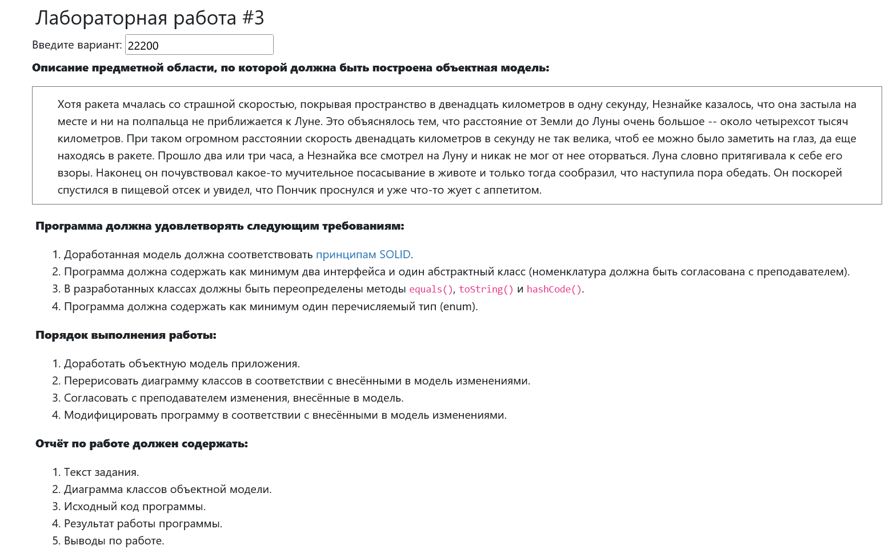
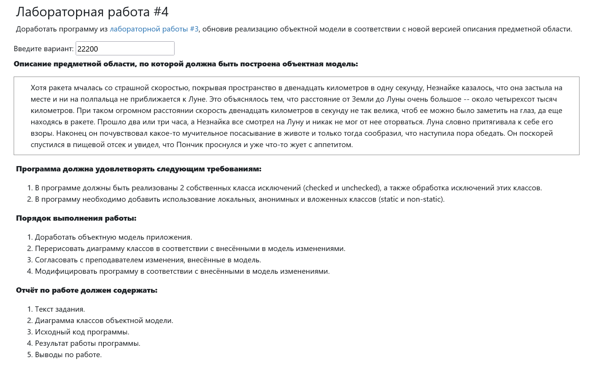
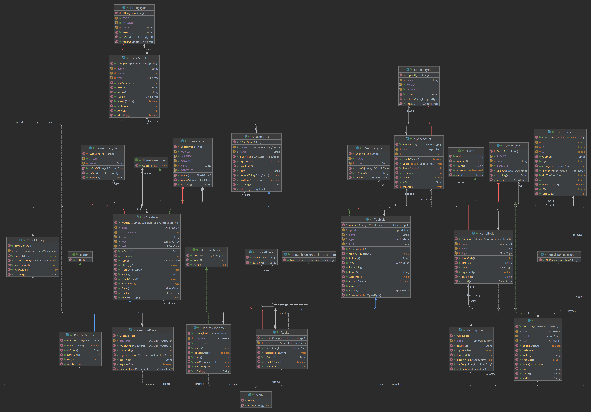

# Программирование 1 семестр. 3-4 Лабораторные задания
Выполнил Антропов Н.А., группа R34351
---
## Задания

Задания представлены на рисунке 1 и рисунке 2

|    |
|:---------------------------------------:|
| <b>Рисунок 1. Лабораторная работа 3</b> |

|    |
|:---------------------------------------:|
| <b>Рисунок 2. Лабораторная работа 4</b> |

## Диаграмма классов

На рисунке 3 представлена UML диаграмма классов

|  |
|:-------------------------------------------:|
|   <b>Рисунок 3. UML диаграмма классов</b>   |

## Вывод программы

Вывод программы представлен в файле out.txt

### Выводы

* Познакомились с принципами объектно-ориентированного программирования SOLID
* Познакомились с использованием интерфейсов и абстрактных классов
* Познакомились с cheked и uncheked исключениями
* Познакомились с построением UML диаграмм классов
